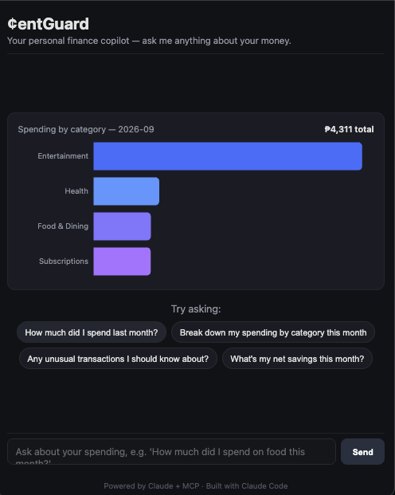

# CentGuard

**A personal finance copilot that quietly watches your cents so you don't have to.**

🔗 **Live:** [cent-guard.vercel.app](https://cent-guard.vercel.app)
🔗 **API:** [centguard-api.onrender.com](https://centguard-api.onrender.com)

> **Note:** The backend runs on Render's free tier, which sleeps after 15 minutes of
> inactivity. If the demo looks stuck loading the spending chart on first visit, that's
> the backend waking up — give it 30-60 seconds and refresh.

CentGuard is a chat-based personal finance assistant powered by Claude. Instead of clicking
through dashboards, you ask questions in plain English — *"How much did I spend on food last
month?"*, *"Any weird transactions this week?"*, *"What's my savings trend?"* — and Claude
answers using **your real transaction data**, retrieved live through a custom **MCP (Model
Context Protocol) server**, not guessed from training data.

This project was built to apply knowledge from four Anthropic certifications:

| Certification | Where it shows up in this project |
|---|---|
| **Claude Code 101** | The entire backend + frontend scaffold was built using Claude Code (see [Built with Claude Code](#built-with-claude-code) below). |
| **Claude Code in Action** | Iterative feature-building workflow — MCP server → tool-calling loop → chat UI — done in agentic sessions. |
| **Claude with Anthropic API** | `backend/app/claude_client.py` — direct Messages API integration with tool-use/function-calling. |
| **Introduction to MCP** | `backend/app/mcp_server/` — a real MCP server exposing finance tools that Claude calls at runtime. |

## Architecture

```
┌─────────────┐      HTTP       ┌──────────────────┐     Anthropic API      ┌────────────┐
│  React Chat │ ───────────────▶│   FastAPI backend │ ──────────────────────▶│   Claude   │
│     UI      │◀─────────────── │  (claude_client)  │◀────────────────────── │  (Sonnet/  │
└─────────────┘   JSON response └──────────────────┘   tool_use requests    │   Haiku)   │
                                          │                                  └────────────┘
                                          │ MCP (stdio)
                                          ▼
                                 ┌──────────────────┐
                                 │   MCP Server      │
                                 │  - get_transactions
                                 │  - spending_by_category
                                 │  - detect_anomalies
                                 │  - monthly_summary
                                 └──────────────────┘
                                          │
                                          ▼
                                   SQLite (transactions)
```

**Flow:** User asks a question → FastAPI sends it to Claude with the MCP tools declared →
Claude decides which tool(s) to call → backend executes the tool call against the MCP server
→ MCP server queries SQLite → results go back to Claude → Claude writes a natural-language
answer (often with numbers it just looked up, not memorized).

## Tech stack (all free-tier / near-$0)

- **Backend:** Python + FastAPI
- **Database:** SQLite (a file — no hosting needed)
- **AI:** Anthropic API (Claude Haiku for dev, Sonnet for demo)
- **Tool layer:** MCP (Model Context Protocol) — Python SDK
- **Frontend:** React + Vite
- **Hosting:** Vercel (frontend) + Render (backend), both free tier

## Project structure

```
CentWhisper/
├── backend/
│   ├── app/
│   │   ├── main.py              # FastAPI app entrypoint
│   │   ├── config.py            # env/settings
│   │   ├── database.py          # SQLAlchemy engine/session
│   │   ├── models.py            # Transaction table
│   │   ├── schemas.py           # Pydantic request/response models
│   │   ├── seed_data.py         # generates fake transactions
│   │   ├── claude_client.py     # Anthropic API + MCP tool-calling loop
│   │   ├── routers/
│   │   │   └── chat.py          # POST /api/chat
│   │   └── mcp_server/
│   │       ├── server.py        # FastMCP server definition
│   │       └── tools.py         # tool implementations (DB queries)
│   ├── run_seed.py              # `python run_seed.py` to seed the DB
│   ├── requirements.txt
│   └── .env.example
└── frontend/
    ├── src/
    │   ├── App.jsx
    │   ├── api/client.js
    │   └── components/
    │       ├── ChatWindow.jsx
    │       ├── MessageBubble.jsx
    │       └── SpendingSummary.jsx
    ├── package.json
    └── vite.config.js
```

## Setup

### 1. Backend

```bash
cd backend
python3 -m venv venv
source venv/bin/activate        # Windows: venv\Scripts\activate
pip install -r requirements.txt

cp .env.example .env
# edit .env and add your ANTHROPIC_API_KEY

python run_seed.py              # creates centwhisper.db with ~150 fake transactions
uvicorn app.main:app --reload --port 8000
```

### 2. Frontend

```bash
cd frontend
npm install
npm run dev
```

Visit `http://localhost:5173` and start chatting with CentWhisper.

## Cost notes

- No subscription needed anywhere in this stack.
- Anthropic API is pay-as-you-go — using Claude Haiku during development keeps this to
  cents per day. A full week of building + demoing should cost well under $5.
- Set a hard spend limit in the Anthropic Console before you start.

## Built with Claude Code

This project was built through an iterative, agentic workflow rather than writing
everything by hand:

- **Scaffolding:** The initial project structure — FastAPI backend, MCP server,
  React frontend — was planned and scaffolded in a single session, then refined
  file by file.
- **Debugging a real breaking change:** Partway through, the MCP Python SDK's
  `FastMCP` class (v1.x) turned out to have been renamed to `MCPServer` in a
  major v2 release, with several fields switching from camelCase to snake_case
  (`inputSchema` → `input_schema`, `isError` → `is_error`). Rather than guessing,
  the fix involved diagnosing the exact traceback, confirming it against the
  official migration guide, and patching both the MCP server definition and the
  Claude tool-calling client to match the new API — a small but realistic example
  of working with a fast-moving SDK ecosystem.
- **Deployment troubleshooting:** Getting the backend running on Render's free
  tier surfaced a real constraint — no shell access on free-tier services — which
  led to redesigning the database seeding to run automatically on app startup
  instead of requiring a manual step. This also fixed a latent problem: Render's
  free tier resets its filesystem on every redeploy, so auto-seeding was the
  right fix either way, not just a workaround.
- **End-to-end verification, not just "it compiles":** Every stage — the MCP
  server's tool schemas, the Claude tool-calling loop, the FastAPI endpoints, and
  the deployed frontend — was tested with real requests and real output before
  moving to the next stage, catching issues like double-slash URL bugs and
  silently-empty files early.



## Roadmap

- [x] Web app (React + FastAPI + MCP)
- [ ] React Native app (Android/iOS) reusing the same backend API
- [ ] Swap SQLite for a hosted Postgres (Supabase free tier) if this needs to stay up long-term
- [x] Add a spending chart (Recharts) driven by the `monthly_summary` tool
